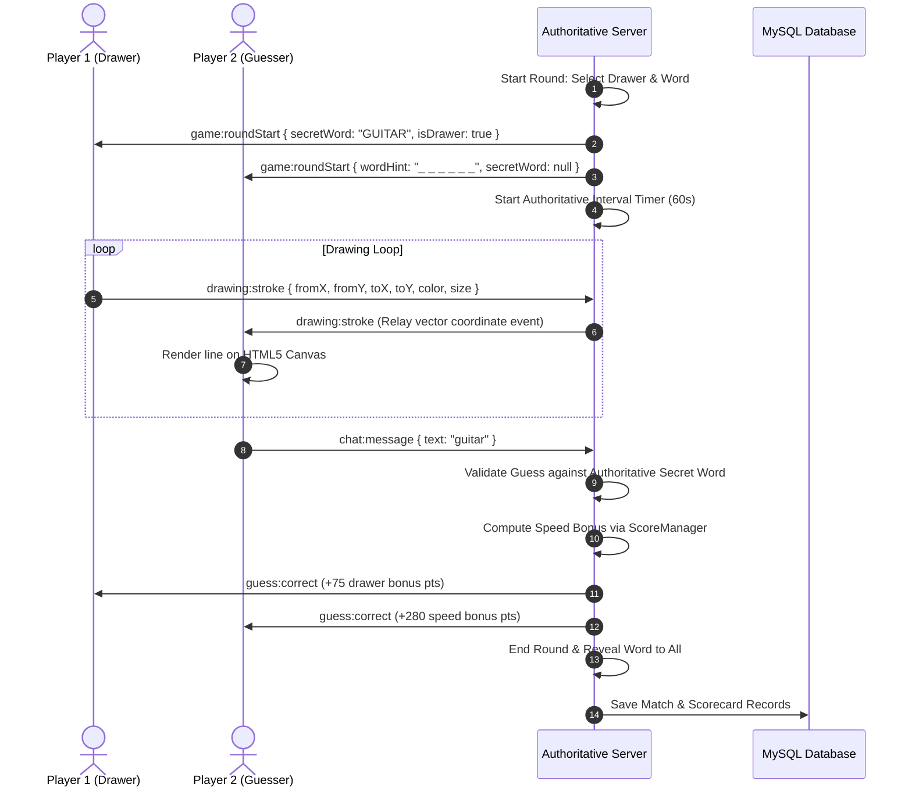

# DOODLZ — Project Documentation & Engineering Report
**"Draw. Guess. Repeat."**

*A Real-Time Authoritative Multiplayer Drawing & Guessing Platform*

---

| **Document Metadata** | **Details** |
| :--- | :--- |
| **Project Name** | DOODLZ |
| **Author / Developer** | Swarna Mithra ([@swarnamithra14](https://github.com/swarnamithra14)) |
| **Repository** | [https://github.com/swarnamithra14/DOODLZ](https://github.com/swarnamithra14/DOODLZ) |
| **Tech Stack** | React 18, Vite, Node.js, Express, Socket.IO, MySQL (`mysql2`), HTML5 Canvas, Web Audio API |
| **Branches** | `main` (Production Release), `develop` (Integration Branch) |
| **Evaluation Level** | Academic / Industry Portfolio Grade |

---

## 1. Executive Summary

**DOODLZ** is a real-time multiplayer drawing and guessing web application engineered with a clean, modern SaaS/game hybrid aesthetic. Rather than mimicking cluttered, cartoonish clones, DOODLZ incorporates minimal, rounded visual hierarchy, typography from Google Fonts (*Outfit* and *Plus Jakarta Sans*), subtle layered shadows, and high-DPI canvas rendering.

The core gameplay loop centers on authoritative, synchronized multi-round matches:
1. One player is authoritatively assigned as the **Drawer** by the server and receives a secret word.
2. The drawer draws the word on an **HTML5 Canvas** in real time.
3. Other players receive masked word clues (`_ _ _ _ _`) and submit live guesses in a real-time chat stream.
4. Correct guesses earn speed-weighted points; the drawer receives participation bonus points for clear drawings.
5. Authoritative server timers tick in synchronized lockstep, rotating drawers between rounds and concluding with an interactive 3-step celebration podium.

---

## 2. System Architecture & Engineering Principles

DOODLZ adheres strictly to an **Authoritative Client-Server Architecture**. Non-drawers never receive the secret word over the network, scores cannot be forged on the client, and drawing actions are converted to lightweight vector coordinate events rather than heavy raster base64 frames.

### 2.1 System Architecture Diagram

```mermaid
flowchart TD
    subgraph Client["React Client (Vite SPA)"]
        UI[Modern SaaS / Game Hybrid UI]
        Canvas[HTML5 Canvas Stage]
        Audio[Web Audio Procedural Sound Engine]
        Chat[Live Guess & Chat Stream]
        SocketClient[Socket.IO Client Singleton]
    end

    subgraph Server["Authoritative Node.js Backend"]
        SocketServer[Socket.IO Server Layer]
        RoomMgr[Authoritative Room Manager]
        GameMgr[Authoritative Game State Engine]
        ScoreMgr[Speed-Weighted Scoring Engine]
        WordMgr[Curated Word Bank & Masking]
        DBPool[mysql2 Pooled Database Layer]
    end

    subgraph Persistence["Persistent Storage"]
        MySQL[(MySQL Database: doodlz)]
    end

    UI --> SocketClient
    Canvas -->|Vector Strokes (x, y, color, size)| SocketClient
    Chat -->|Guesses & Chat Messages| SocketClient
    SocketClient <==>|Bidirectional WebSockets (WSS)| SocketServer

    SocketServer --> RoomMgr
    SocketServer --> GameMgr
    GameMgr --> ScoreMgr
    GameMgr --> WordMgr
    GameMgr -.->|Match Records & Scores| DBPool
    DBPool -.-> MySQL
```

---

### 2.2 Sequence Diagram: Real-Time Round Lifecycle



---

## 3. Completed Development Modules

### Module 0: Project Foundation
- Scaffolding of React + Vite frontend and Node.js + Express backend.
- Implementation of `mysql2/promise` connection pool with graceful non-crashing offline standby.
- Git repository initialization with `main` and `develop` branching strategy.
- Monorepo package scripts (`install:all`, `dev:server`, `dev:client`).

### Module 1: Frontend UI Architecture
- Custom CSS design system replacing ad-hoc utilities (HSL color tokens, rounded card radiuses, Google Fonts typography, status pills).
- Implementation of 5 complete user views:
  - **Landing Page (`/`)**: Hero branding, feature showcase, "How to Play" modal.
  - **Lobby Page (`/lobby`)**: Create and Join game cards with preset chip selectors.
  - **Waiting Room (`/room/:roomId`)**: Player roster with color-coded avatar initials, host crown badge, 1-click room code copying.
  - **Game Arena (`/game/:roomId`)**: High-DPI canvas stage, drawing toolbar, live ranked scoreboard, and chat stream.
  - **Results Podium (`/results/:roomId`)**: 1st, 2nd, 3rd place stepped podium cards, complete scorecards, and rematch actions.

### Module 2: Authoritative Real-Time Multiplayer Engine
- Authoritative Room Management (`RoomManager.js`): Unique 6-character room codes (`DZ-XXXX`), max 8 player limits, dynamic host transfer on host departure.
- Authoritative Game Management (`GameManager.js`): State machine (`LOBBY` → `STARTING` → `DRAWING` → `ROUND_END` → `GAME_OVER`), secret word masking, server interval timers, speed-weighted scoring.
- High-Performance Normalized Vector Canvas: Proportional coordinates (`0.0 to 1.0`) ensuring responsiveness across any screen size without distortion.
- Anti-Cheat Word Secrecy: Non-drawers never receive the secret word over the wire.

### Module 3: Polish, Web Audio Effects & Resilience
- **Procedural Web Audio Engine (`audio.js`)**: Real-time synthesizer oscillators generating chord chimes on correct guesses, energetic pops on round starts, and clock ticks on low time. Zero external `.mp3` dependencies.
- **Mute / Unmute Toggle**: Interactive volume controller embedded directly in the Navbar.
- **Session Persistence**: Reconnection recovery via `sessionStorage` preventing match loss on accidental browser refreshes.
- **Toast Notification System (`Toast.jsx`)**: Floating glassmorphic alerts for clipboard copies, player joins, and match status changes.
- **Unified Full-Stack Distribution**: Configured Express backend to statically serve the React client build on a unified port.

---

## 4. UI Screen Breakdown & Visual Layouts

### 4.1 Landing Page (`/`)
```text
+---------------------------------------------------------------------------------+
| (Palette) DOODLZ [PRO]                                       [Volume] [● Online]|
+---------------------------------------------------------------------------------+
|                                                                                 |
|                      ✨ Real-Time Multiplayer Canvas                            |
|                          Draw. Guess. Repeat.                                   |
|       Draw it. Your friends guess it. Race the authoritative clock.             |
|                                                                                 |
|            [ ▶ Create Game ]    [ 👥 Join Game ]    [ ❔ How to Play ]          |
|                                                                                 |
|   +--------------------+  +--------------------+  +-------------------------+   |
|   | 👥 Real-Time       |  | ⏱️ Timed Rounds    |  | 💬 Instant Live Guess   |   |
|   | Up to 8 players,   |  | 45s-90s countdown  |  | Chat stream highlights  |   |
|   | zero desync rooms. |  | synced by server.  |  | correct answers live.   |   |
|   +--------------------+  +--------------------+  +-------------------------+   |
+---------------------------------------------------------------------------------+
```

### 4.2 Game Arena (`/game/:roomId`)
```text
+---------------------------------------------------------------------------------+
| Round 2 / 3  |  [👑 You are Drawing]  |   Word: ELEPHANT   |   ⏱️ 48s   | [Podium] |
+---------------------------------------+--------------------+--------------------+
|                                       | LIVE STANDINGS     | LIVE GUESS FEED    |
|                                       |--------------------+--------------------|
|                                       | #1 Swarna  450 pts | System: Marcus is  |
|            HTML5 CANVAS STAGE         | #2 Sophia  320 pts |         drawing.   |
|          (High-DPI Vector Grid)       | #3 Marcus  200 pts | Sophia: is it dog? |
|                                       |                    | 🎉 Sophia guessed! |
|                                       |                    |    (+280 pts)      |
|                                       +--------------------+--------------------|
|                                       | Type guess here...             [ Send ] |
+---------------------------------------------------------------------------------+
| [✏️ Brush] [🧽 Eraser] | Sizes: [S][M][L][XL] | Colors: ● ● ● ● ● ● ● | [🗑️ Clear] |
+---------------------------------------------------------------------------------+
```

### 4.3 Final Results Podium (`/results/:roomId`)
```text
+---------------------------------------------------------------------------------+
|                             ✨ Match Concluded                                  |
|                             FINAL LEADERBOARD                                   |
|                                                                                 |
|                      👑 Champion: Swarna (1420 pts)                             |
|                                                                                 |
|            Sophia (1180 pts)     [  1st Place  ]                                |
|             [  2nd Place   ]     [    Gold     ]       Marcus (950 pts)         |
|             [    Silver    ]     [   Podium    ]       [  3rd Place   ]         |
|             [    Podium    ]     [  (Highest)  ]       [    Bronze    ]         |
|                                                                                 |
|                       [ 🔄 Play Again ]   [ 🏠 Back to Lobby ]                  |
+---------------------------------------------------------------------------------+
```

---

## 5. Technical Decision Highlights

| Engineering Decision | Why it was chosen | Alternative considered & rejected |
| :--- | :--- | :--- |
| **Vector coordinate events (`0..1`)** | Transmits ~25 bytes per stroke for instantaneous 60fps rendering across devices. | Base64 PNG snapshots: ~500KB per frame, massive lag, unfeasible for multiplayer. |
| **Server-authoritative timers** | Server ticks timestamps; prevents client clock tampering or speed manipulation. | Client `setInterval`: prone to drift, desync, and browser background tab freezing. |
| **Procedural Web Audio API** | Generates real-time harmonic chimes via mathematical oscillators without network latency. | External `.mp3` audio files: potential 404 errors, network loading delay, asset bloat. |
| **SessionStorage re-hydration** | Allows players to refresh their browser tab without dropping out of active rooms. | Local React state only: completely wipes player state on accidental refresh. |
| **MySQL connection pool with fallback** | Persists match records while gracefully degrading to in-memory mode if DB is offline. | Hard-coded DB crashes: app crashes entirely if MySQL service is paused. |

---

## 6. Git Commit Verification

The repository contains 5 clean Conventional Commits:

```bash
git log --oneline
# 30bb06e feat: enable unified static client serving and auto-origin resolution
# 99e070a docs: add deployment configuration and deployment guide
# 8c607d2 feat: implement Web Audio engine, toast notifications, reconnection persistence, and mobile responsiveness
# a38d4cc feat: implement authoritative multiplayer engine with room lifecycle, drawing sync, timers, and scoring
# 41b32aa feat: implement frontend UI architecture with landing, lobby, room, game, and results pages
# b92ee7f chore: initialize Doodlz project
```

---

## 7. Next Step: Firebase Realtime Database Architecture Migration

To enable **100% free, 24/7 serverless public deployment with zero credit card requirements**:
- Transition real-time room and stroke synchronization from Node.js/Socket.IO to **Firebase Realtime Database (RTDB)**.
- Deploy the unified application onto **Firebase Hosting** with a single command (`firebase deploy`).
- Preserve all existing UI design tokens, canvas vector calculations, Web Audio synthesis, and speed-scoring algorithms intact.
